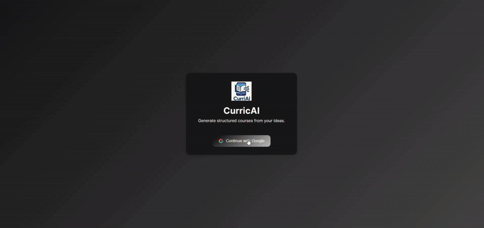

# 🧠 CurricAI: AI-Powered Course Generator

[](https://curric-ai-zeta.vercel.app/home)  
**Tech Stack:** React (Vite) · Node.js · Express · MongoDB · Auth0 · OpenAI · YouTube API  

---

## 🚀 Overview
CurricAI is a **dynamic full-stack AI-powered web application** that transforms a simple topic prompt into a complete, structured learning course.  
It automatically generates course outlines, modules, and detailed lessons enriched with videos, quizzes, and multilingual explanations — creating a self-contained, interactive learning experience from a single line of text.

---

## 🎥 Demo Video
  

---

## 💡 Key Highlights

- **🧩 AI-Powered Curriculum Generation**  
  Converts any topic (e.g., *“Intro to React Hooks”*) into structured courses with modules, lessons, objectives, and key concepts using OpenAI.

- **⚡ Dynamic & Interactive Site**  
  Real-time course creation and rendering with persistent storage and user-specific sessions — not a static generator.

- **📚 Rich Lesson Experience**  
  Lessons include text, syntax-highlighted code blocks, MCQs with explanations, and embedded YouTube videos.

- **🔐 Secure Auth & Personalization**  
  Implemented **Auth0** for OAuth 2.0 login, allowing each user to generate, save, and revisit personalized courses.

- **🧾 Lesson PDF Export**  
  Added a custom exporter using `jsPDF` and `html2canvas` for offline learning.

- **🌐 Seamless Cloud Deployment**  
  Frontend hosted on **Vercel**, backend on **Railway**, with CI/CD automation via GitHub Actions.

---

## 🧠 Technical Architecture

**Frontend:**  
- Built with **React + Vite** for fast development and modularity.  
- Global state managed via Context API.  
- Auth-protected routes using the Auth0 React SDK.
- Fully responsive UI.  

**Backend:**  
- RESTful API built with **Node.js + Express**.  
- **Mongoose** schemas define relationships: Course → Module → Lesson.  
- Middleware handles authentication, validation, and centralized error control.  
- AI services generate course structures and enrich lesson content.

**Database:**  
- **MongoDB Atlas** provides scalable document storage.  
- Indexed relationships ensure fast retrieval of user-specific data.

**External Integrations:**  
- **OpenAI API** for course and lesson generation.  
- **YouTube Data API** for contextual educational videos.

**Deployment:**  
- **Vercel** for frontend builds and hosting.  
- **Railway** for backend hosting and environment variables.  
- **GitHub Actions** for CI/CD pipelines.

---

## 🧩 System Flow

1. **Prompt Input:** User enters a topic.  
2. **AI Processing:** Backend calls OpenAI to generate structured course JSON.  
3. **Data Persistence:** Course, modules, and lessons stored in MongoDB.  
4. **Rendering:** React frontend dynamically displays the generated content.  
5. **Enhancements:** Lessons include videos, MCQs, and downloadable PDFs.  
6. **Personalization:** Auth0 ties saved courses to individual users.

---

## 🧰 Core Features Summary

| Feature | Description |
|----------|-------------|
| **Prompt-to-Course** | AI-generated structured learning modules |
| **Dynamic Lesson Renderer** | Renders JSON-based interactive content |
| **Auth0 Login** | OAuth 2.0 authentication and protected routes |
| **Video Integration** | Auto-suggested YouTube resources |
| **PDF Export** | Download lessons for offline learning |
| **Persistent Storage** | MongoDB-backed user data and saved courses |

---

## 🧑‍💻 Achievements & Learnings

- Engineered a **multi-stage AI prompt pipeline** to sequentially generate course outlines and lessons.  
- Developed a **modular, scalable MERN architecture** with secure authentication.  
- Built **robust error handling** for unpredictable AI JSON outputs.  
- Optimized **API efficiency and token usage** for faster generation.  
- Delivered a **fully deployed, production-ready stack** integrating multiple APIs securely.

---

## 📜 Setup Instructions

```bash
# Clone repository
git clone https://github.com/yourusername/curricai.git

# Backend Setup
cd backend
npm install
npm run dev

# Frontend Setup
cd frontend
npm install
npm start
